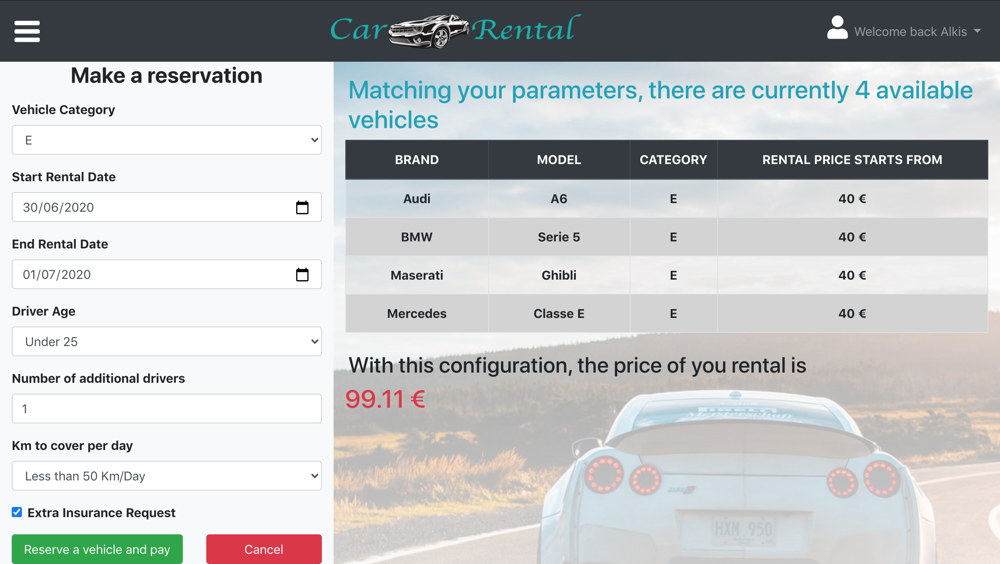

# Car-Rental-WebApp
WebApp Project - Testato su ``Google Chrome``.

## React client application routes

- Route `/public/vehicles`: pagina iniziale per gli utenti non loggati, ma anche home principale per gli utenti loggati, cui si viene re-indirizzati automaticamente una volta completata correttamente la procedura di login. Contiene l'intera lista (senza duplicati) dei veicoli (ordinati per categoria, marca, modello), e una sidebar (che è possibile aprire e chiudere tramite il pulsante all'estrema sinistra della navbar in alto) con i filtri per categoria e marca.
- Route `/login`: pagina delegata al login degli utenti. Contiene il logo dell'applicazione, nonchè una procedura per entrare direttamente nell'applicazione se si è l'utente già salvato (alkis, in questo caso), o in alternativa un form da compilare per potersi poi loggare (che si apre premendo sul button ***Cambia account***). Ci si accede premendo l'opportuno button all'estrema destra della navbar. I button ***Login*** o ***Continua come Alkis*** redirigono alla pagina `/public/vehicles`.
- Route `/user/profile`: pagina contenente la lista dei noleggi (passati, presenti e futuri) dell'utente. Tramite i due button -che si trovano subito sotto la navbar- è possibile vedere rispettivamente solo i noleggi passati, solo i presenti e futuri (ed eventualmente cancellare la prenotazione di questi ultimi), o tutti insieme. Il button ***click here*** redirige alla pagina `/user/rental`. Ci si accede dall'apposito link nel dropdown menu all'estrema destra della navbar in alto (solo per un utente già loggato).
- Route `/user/rental`: pagina contenente:
  - il configuratore interattivo, costituito da una sidebar sulla sinistra (che è possibile aprire e chiudere tramite il pulsante all'estrema sinistra della navbar in alto) in cui è possibile scegliere i valori desiderati per i vari criteri, e da una lista dei veicoli disponibili, accompagnata dal numero degli stessi e dal prezzo relativo alla particolare configurazione di noleggio scelta. Il button ***Cancel*** redirige alla pagina `/user/profile`, mentre quello ***Reserve a vehicle and pay*** apre il form per il pagamento.
  - il form del pagamento (che sostituisce nella pagina il configuratore) contiene i campi (relativi alla carta di credito dell'utente) che è necessario compilare per completare l'operazione di noleggio di un veicolo. Il button ***Confirm*** aprirà un opportuno alert, dal quale sarà possibile tornare nella pagina `/user/profile` (se l'operazione si è conclusa con successo) o di nuovo nel form del pagamento (se qualche campo non è stato inserito correttamente). Il button ***Back to selection*** consente di tornare alla visualizzazione del configuratore.

## REST API server

<!-- 
- POST 
  - request parameters and request body content
  - response body content 
- GET 
  - request parameters
  - response body content
-->
- POST `/api/login`
  - no parameters
  - request body: username, password
  - response body: userID(=username), userName(=name)
- POST `/api/logout`
  - no parameters
  - no request body
  - no response body
- GET `/api/public/vehicles`
  - request query parameters: category, brand (opzionali)
  - response body: veicoli, eventualmente filtrati in base ai query parameters passati
- GET `/api/user`
  - no request parameters
  - response body: user
- GET `/api/rentals`
  - no request parameters
  - response body: noleggi (in join con la tabella vehicle), relativi allo user correntemente loggato
- GET `/api/vehicles/rented`
  - request query parameters: category, start, end (opzionali)
  - response body: veicoli già in noleggio relativamente ai query parameters specificati
- DELETE `/api/rentals/:rentalId`
  - request parameters: rentalId
  - response body: conferma dell'eliminazione(status 204)
- POST `/api/rentals/payment`
  - no parameters
  - request body: oggetto payment (owner, cvv, cardNumber, expirationDate)
  - response body: conferma del pagamento (status 200)
- POST `/api/rentals`
  - no parameters
  - request body: oggetto rental (vehicleId, startDate, endDate, price)
  - response body: id del noleggio appena inserito

## Server database

- Tabella `rental` - Ha 6 colonne(attributi): id (CHIAVE PRIMARIA), vehicleId, username, startDate, endDate, price.
Contiene 23 noleggi (distribuiti tra i 5 utenti), dei quali descrive le caratteristiche sopra indicate.
- Tabella `user` -  Ha 4 colonne(attributi): id (CHIAVE PRIMARIA), username, password, name.
Contiene 5 utenti, dei quali descrive le caratteristiche sopra indicate.
- Tabella `vehicle` -  Ha 5 colonne(attributi): id (CHIAVE PRIMARIA), category, brand, model, price.
Contiene 28 veicoli, dei quali descrive le caratteristiche sopra indicate.

## Main React Components

- `Configurator` (in `Configurator.js`): mostra la pagina relativa al configuratore, con sidebar e veicoli disponibili. Mantiene lo stato dei filtri relativi a categoria, data di inizio e fine del noleggio, e di tutte le informazioni che servono sia al RentalForm che al PaymentForm, che richiama al suo interno. Aggiorna dinamicamente la lista ed il numero di veicoli disponibili, unitamente al prezzo del noleggio, al variare della configurazione selezionata (passata dal RentalForm). Contiene anche un metodo per selezionare l'id del veicolo da noleggiare. Se scade il token, redirige alla pagina di login.
- `Filters` (in `Filters.js`): mostra i filtri della sidebar relativa alla pagina pubblica (e alla home dell'utente loggato). Si divide in particolare in due sezioni, il cui contenuto è sito all'interno di un elemento di tag ***Accordion*** (e quindi può essere nascosto o mostrato all'occorrenza): ***Brands*** (come ListGroup), che permette di filtrare per una o più marche contemporaneamente, e ***Categories*** (come Switch), che permette analogamente di filtrare per una o più categorie contemporaneamente.
- `Login` (in `Login.js`): mostra la pagina relativa alla procedura di login, e redirige alla pagina `/public/vehicles` se completata correttamente. Chiama al suo interno LoginForm. Effettua la chiamata a API.userLogin(user,pass) per terminare correttamente tale procedura.
- `LoginForm` (in `Login.js`): contiene il form relativo alla procedura di login (e i metodi per aggiornare lo stato e validare i campi). Mantiene già salvate nello stato le informazioni relative allo user "alkis".
- `Navbar` (in `Navbar.js`): mostra la navbar che è situata nella parte superiore del sito. Contiene sulla sinistra l'icona (a classica forma di hamburger), da cui si può aprire o chiudere la sidebar nelle varie pagine, al centro il logo, cliccando sul quale si ritorna nella pagina `/public/vehicles`, e sulla destra il button ***Login*** se l'utente non è loggato, o un dropdown menu con i link alle varie pagine (Home -`/public/vehicles`- e Profile -`/user/profile`-) e con la procedura di logout nel caso contrario.
- `PaymentForm` (in `PaymentForm.js`): mostra il form relativo al pagamento, e gli eventuali alerts relativi al successo o al fallimento della procedura di pagamento (e quindi di inserimento nel db del noleggio). Effettua dunque dei controlli sui valori inseriti, e gestisce il submit richiamando infine la funzione checkPaymentAddRental(payment, rental), passata come props.
- `RentalElement` (in `RentalElement.js`): mostra il singolo elemento della tabella dei noleggi, distinguendo tra noleggio completato, in corso o futuro, e consentendo di eliminare quanti appartengono a quest'ultima categoria (attraverso un apposito alert), andando a chiamare l'opportuna funzione deleteRental(rental) passata come props.
- `RentalForm` (in `RentalForm.js`): mostra il form relativo ai criteri da selezionare per il noleggio. Mantiene lo stato relativo ai vari campi (ad eccezione di categoria, data di inizio e di fine che sono mantenuti nel componente padre, Configurator), e contiene la funzione per calcolare dinamicamente il prezzo, aggiungendo o togliendo le percentuali relative ad ogni criterio selezionato. Se cliccato, il button ***Reserve a vehicle and pay***, che compare solo quando sono stati inseriti tutti i campi (ad eccezione dell'assicurazione extra) apre il form del pagamento.
- `RentalsList` (in `RentalsList.js`): mostra la lista dei noleggi, strutturata come tabella, andando a chiamare il componente RentalElement. Se scade il token, redirige alla pagina di login.
- `ReservationFilters` (in `ReservationFilters.js`): mostra la pagina relativa al percorso `/user/profile`, con due button che permettono di mostrare o nascondere i noleggi passati o presenti e futuri. Per la lista dei noleggi, viene richiamato il componente RentalsList. Il button ***click here*** redirige alla pagina `/user/rental`.
- `VehicleElement` (in `VehicleElement.js`): mostra il singolo elemento della tabella dei veicoli, con marca, modello, categoria e prezzo.
- `VehiclesList` (in `VehiclesList.js`): mostra la lista dei veicoli, strutturata come tabella, andando a chiamare il componente VehicleElement.

## Screenshot

## Test users

* alkis@email.it, password (cliente frequente, con più di 3 noleggi terminati)
* user1@test.it, password (cliente frequente, con più di 3 noleggi terminati)
* user2@test.it, password 
* user3@test.it, password
* user4@test.it, password 

Per testare la condizione sul 10% di veicoli rimasti nel garage, è possibile prenotare un veicolo di categoria A nel periodo 27/07/2020-30/07/2020: già 10 veicoli della stessa categoria sono stati prenotati dai vari utenti in quelle date.
